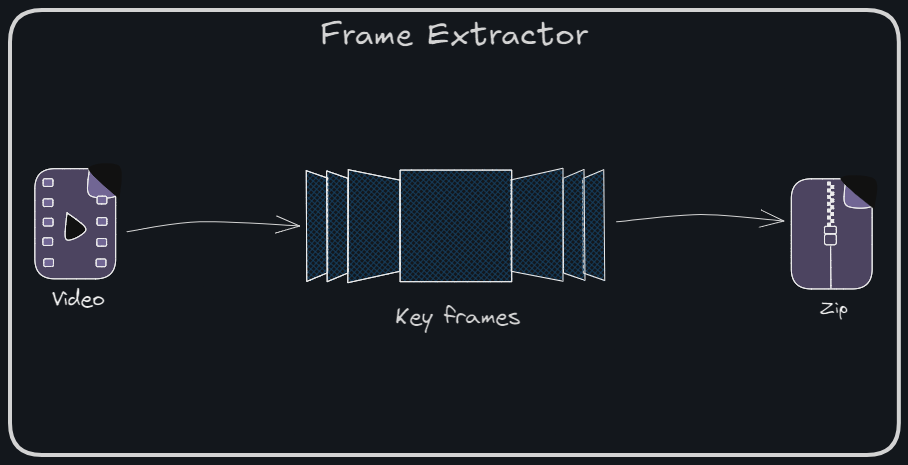

# Keyframe Extractor Microservice
**Part of the Video Search Engine Project**  

This repository contains a Flask-based web service that extracts keyframes from uploaded videos using Structural Similarity Index (SSIM) and Mean Squared Error (MSE) as metrics. The extracted keyframes are then zipped and can be posted to another service.



## Features

- Extract keyframes from video using SSIM or MSE.
- Save extracted keyframes to a specified directory.
- Zip the keyframes directory for easy transfer.
- REST API endpoints for checking service status and extracting keyframes.
- Supports both **Standalone** and **Chained** modes.

## Modes

- **Standalone Mode**: Extracted keyframes are zipped and provided directly for download.
- **Chained Mode**: Extracted keyframes are zipped and then posted to 'Vision Transformer' microservice for further processing.

## Installation
### Prerequisites
- Python 3.12

### Steps  
1. Clone the repository:
   ```bash
   git clone https://github.com/iam-VK/frame_extractor.git
   cd frame_extractor
   ````
2. Install the required dependencies:
    ```bash
    ./setup.sh
    ```
3. Run the Flask application:  
    ```bash  
    ./run.sh
    ```  
4. The service will be available at `http://0.0.0.0:5001`

## Endpoints
- ### Service Status

    - **URL**: `/`
    - **Method**: `GET` or `POST`
    - **Response**:
    ```json
    {
        "status": "Alive",
        "endpoints": {
            "/keyframe_extract": {
                "method":"[POST]",
                "paramaters": {
                        "file_upload":"video file for keyframes extraction",
                        "mode":"optional parameter, can be 'standalone' or 'chained' (default: 'chained')"
                    }
                }
            }
        }
- ### Keyframe Extraction

    - **URL**: `/keyframe_extract`
    - **Method**: `POST`
    - **Request**: Multipart form data with video file (file_upload) and mode (optional)
    - **Response**: 
    ```json
    {
        "Frame Extractor service": {
            "Status": "Success",
            "keyframes_extracted": <number of keyframes extracted>
        },
        "File URL": "<URL to download the zipped keyframes>" // Only in standalone mode
        "ViT service": {<response from the chained service>} // Only in chained mode
    }
<!-- ## Project Structure
```bash
    frame_extractor/
    ├── app.py                # Flask application
    ├── api_requests.py       # Utility for multipart POST request
    ├── frame_extractor.py    # Functions to extract keyframes from video
    ├── zipper.py             # Utility to zip directories
    ├── requirements.txt      # List of dependencies
    ├── README.md             # Project README
    ├── setup.sh              # Setup virtual env and install dependencies
    ├── run.sh                # Starts the microservice  
    └── clean_cache.sh        # Deletes the cache files and cache directories 
    |──────────────Cache files──────────────
    ├── uploads               # Uploaded videos
    ├── key_frames            # Extracted keyframes
    └── key_frames.zip        # Extracted keyframes zipped and ready to ship
     -->